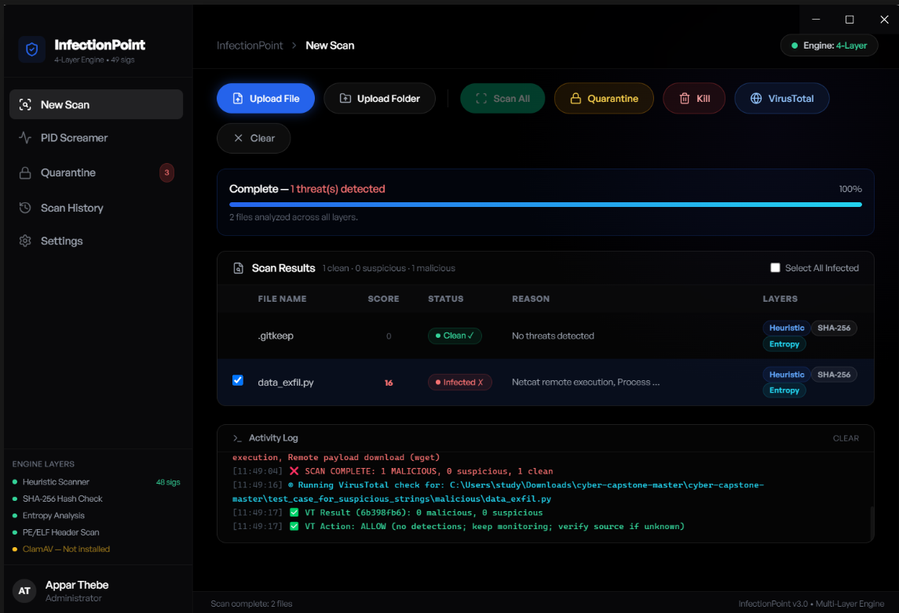
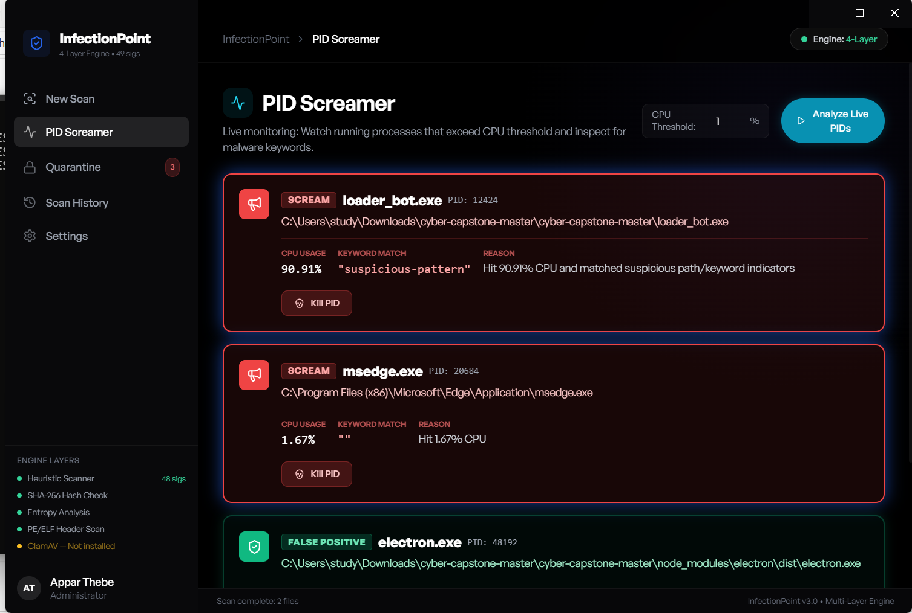

# InfectionPoint Threat Detection Engine

---

## Objective

The objective of this project was to support malware detection and process monitoring inside the InfectionPoint security tool by integrating a VirusTotal API backend workflow and a PID Screamer monitoring feature.

For the VirusTotal API portion, I connected the scanner to VirusTotal so that when a file is scanned, the tool can check whether that file hash has already been analyzed before. If VirusTotal has existing results and the file is flagged, the tool reports that information back into the GUI activity log.

For the PID Screamer portion, I worked on a feature that checks running processes and helps identify suspicious behavior based on CPU usage and process indicators. The PID Screamer is still being improved, but the main functionality is working. It can show when a process has high CPU usage and help alert the user that the process may need further review.

The GUI, activity log display, and kill process functionality were developed collaboratively. I did not create the kill process feature, but it is connected to the PID Screamer workflow. When administrative permissions are available, the kill process feature can terminate selected suspicious processes.

---

## Skills Learned

- Integrated VirusTotal API into a malware scanning workflow.
- Used file hash checking to determine whether a file had been previously scanned.
- Reported VirusTotal API results into the GUI activity log.
- Worked with backend security logic connected to a graphical interface.
- Built and tested PID Screamer process monitoring functionality.
- Checked process behavior based on CPU usage and suspicious indicators.
- Reviewed process activity using Windows Task Manager and Linux `top`.
- Learned how administrative permissions affect process termination.
- Practiced documenting collaborative security tool development.
- Improved understanding of malware triage, process monitoring, and endpoint-style detection.

---

## Tools Used

- VirusTotal API
- PID Screamer
- InfectionPoint GUI
- Windows Task Manager
- Linux `top`
- File hash checking
- Activity logging
- Process monitoring
- Administrative process control
- Backend security logic

---

## Steps

Every screenshot includes a short explanation of what is being shown.

### Ref 1: VirusTotal API Scan Output

This screenshot shows the VirusTotal API workflow inside InfectionPoint. When a file is scanned, the backend checks whether the file has already been analyzed by VirusTotal. If the file has existing scan results, the tool reports the result back into the GUI activity log. In this example, the activity log shows the VirusTotal check and the final recommendation.

---

### Ref 2: PID Screamer Process Monitoring

This screenshot shows the PID Screamer feature inside InfectionPoint. The PID Screamer checks running processes and highlights suspicious behavior based on CPU usage and process indicators. The feature helps the user identify processes that may need review in Windows Task Manager or Linux `top`.

---

## My Contribution

My main contributions were:

- Integrated the VirusTotal API backend workflow.
- Added logic to check whether scanned files had existing VirusTotal results.
- Helped send VirusTotal scan results into the GUI activity log.
- Worked on the PID Screamer process monitoring feature.
- Tested how suspicious processes appear through CPU usage and process indicators.
- Documented the scanner behavior and project results.

The GUI layout, activity log interface, and kill process feature were developed collaboratively. I did not personally build the kill process feature, but it is attached to the PID Screamer workflow and can terminate selected processes when administrative permissions are available.

---

## Summary

This project helped me understand how security tools combine file reputation checks, API-based threat intelligence, process monitoring, and GUI-based reporting. The VirusTotal API integration allowed the tool to check previously scanned files and report suspicious results, while the PID Screamer added process monitoring based on CPU usage and suspicious indicators.
